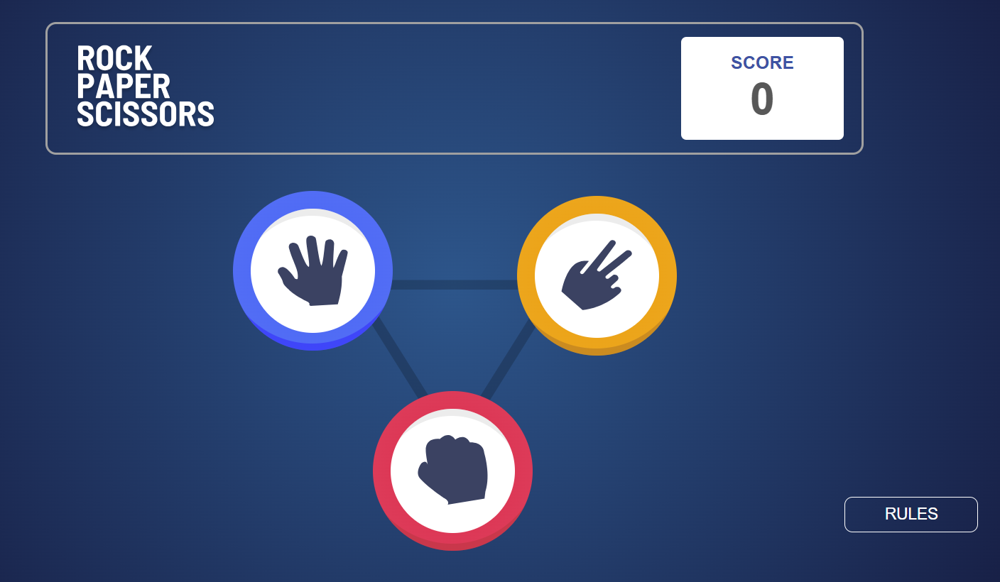
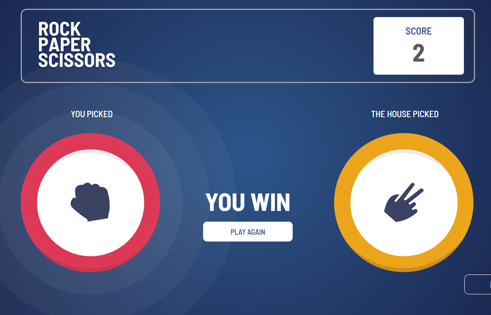

# Piedra papel y tijeras 🪨 📜 ✂️
Aplicación inspirada en el clásico juego de Piedra, Papel o Tijeras.  
El usuario elige una ficha y el sistema selecciona aleatoriamente la del oponente.  
El resultado se muestra de inmediato y el marcador se actualiza automáticamente.  
Este proyecto fue desarrollado como parte de un reto de la plataforma Frontend Mentor. 

## Capturas

## Tecnologías 🔎

## Características 💎
-Interfaz dinamica  
-Diseño responsivo  
-Juego interactivo  
-Logica de juego  

## Instalación 🔧
Este proyecto no requiere ningun tipo de instalacion, todo esta en las carpetas.  
-Si se desea modificar el main.ts, si seria necesario instalar node.js

## Uso 💡
Es un juego simple, 3 fichas: Piedra, Papel y Tijeras.  
Selecciona una y la maquina elegira otra, instantaneamente, se sabra el resultado. 👀

## Demo 📌
https://piedrapapeltijerasss.netlify.app/

## Licencia
All Rights Reserved.

## Contacto 🧭​
💻 **Mi perfil de Linkedin:** [Linkedin](https://www.linkedin.com/in/adam-samuel-inzunza-ramirez/)  
🌐 **Mira mi portafolio!** [Portafolio](https://cuandoyolabi.github.io/PortafolioFrontend/)  
📩 **Email: [adaminzunza3@gmail.com](mailto:adaminzunza3@gmail.com)** ​  
📱 **Telefono: 3320664573**
